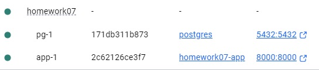
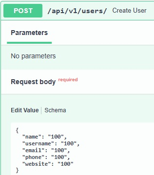
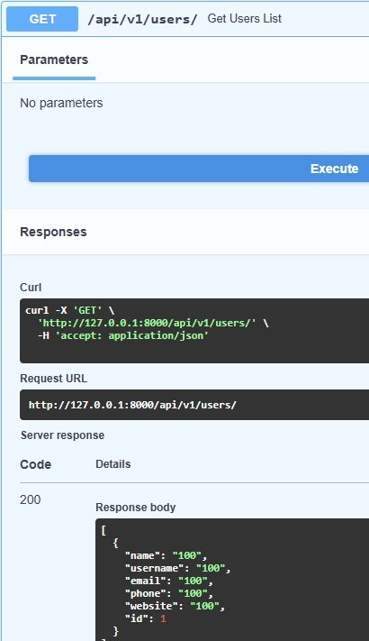

### Курс "Python Developer. Basic" ###

### Домашнее задание № 7 ###

## Взаимодействие между контейнерами ##

### Запуск приложения ###  
docker compose up -d   
**[127.0.0.1:8000/docs](http://127.0.0.1:8000/docs#/)**   
**[127.0.0.1:8000/api/v1/users/)**   

### Результаты выполнения ###   
   
   
   

