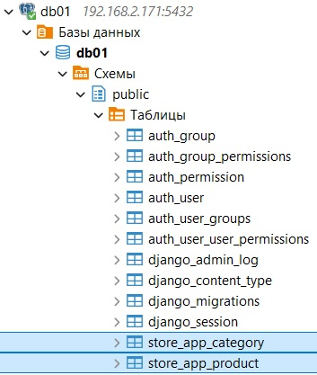

### Курс "Python Developer. Basic" ###

### Домашнее задание № 8 ###

## Создание проекта, работа с моделями и продвинутая настройка админки ##

### Команды в терминале ###

```
pip install django   
pip install "psycopg[binary]"
      
django-admin startproject config .   
python manage.py startapp store_app   
python manage.py runserver
      
python manage.py migrate   
python manage.py createsuperuser
      
python manage.py makemigrations
python manage.py migrate
```

### URLs ###

http://127.0.0.1:8000/   
http://127.0.0.1:8000/about/   
http://127.0.0.1:8000/admin/

### Добавление данных из командной строки ###

```
python manage.py shell
```

```
>>> from store_app.models import Category
>>> category = Category(name='Канцтовары', description='Ручки, тетради и т.д.')
>>> category.save()
   
>>> from store_app.models import Product
>>> product = Product(name='Ручка',description='Ручка Pilot', price=200, category=category)
>>> product.save()   
```

### Результат применения миграций ###


