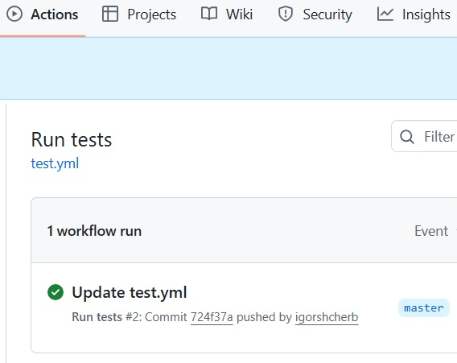

### Курс "Python Developer. Basic" ###

### Домашнее задание № 12 ###

## GitHub Actions ##

## Выполнил ## 

1. В директорию HomeWork12 скопировал файлы из директории HomeWork11 (вместе с тестами)
2. В github по шаблону "Python application" создал action:

### [test.yml](../.github/workflows/test.yml) ###

3. Выполнил тест локально в терминале:

```
cd HomeWork12
pytest
```

```
====================== test session starts =====================
platform win32 -- Python 3.13.0, pytest-8.3.5, pluggy-1.5.0
django: version: 5.2.4, settings: config.settings (from ini)
rootdir: C:\Work\PycharmProjects\HomeWork12
configfile: pytest.ini
plugins: anyio-4.9.0, Faker-37.4.0, django-4.11.1, mock-3.14.1
collected 4 items                                                                                                                                                                                                

store_app\tests\test_models.py ....                                                                                                                                                                        [100%]

======================= 4 passed in 0.46s ======================
```

4. Выполнил push в github и убедился, что тесты выполнились без ошибок:




